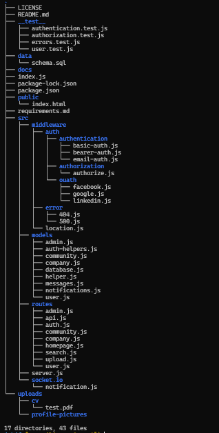
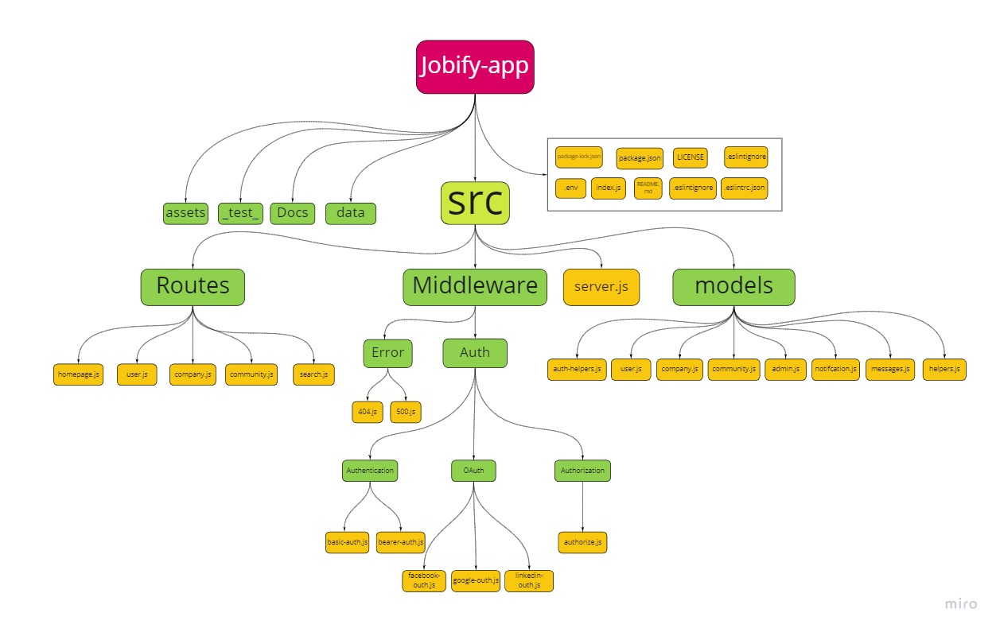
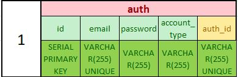
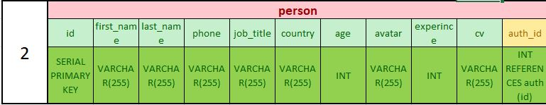
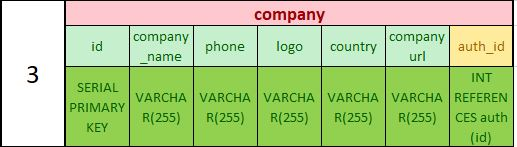
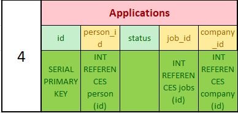
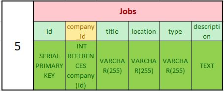
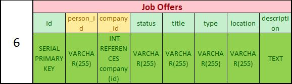
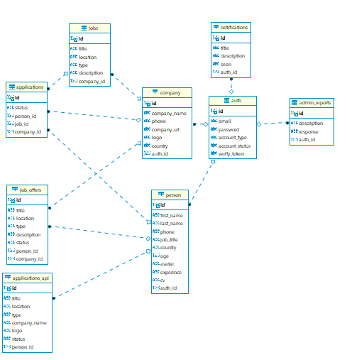

# Jobify-app

## Back-End App

### Current Version \(0.0.1\)

* The Current version of this application is designed to create, read, update, and delete data that is used to search, apply, and send for a job offer depending on what they choose.
* This APP was designed to be extensible, so that multiple match types and data sources can be supported in future installments.
* The user can be able to use the app depend on the roles and we used fetch method to work on the data from the API.

### Architecture

 The base technologies used in this application are `node.js`, it's built-in `http` module, `express.js` and it's middleware methods, using `postgress` and `mongoDB` databases:

## Group members:

* **Abdallah Zakaria**
* **Abdulhakim Zatar**
* **Mohmmad Al-Esseili**
* **Osama Althabteh**

### Problem Domain

Day by day the unemployment issue became a big problem in the world, although that there are so many platforms that help people find jobs, they are too many to follow and a bit complicated in some way , so our plan is to make an employment hub that combine all jobs from different sources in one place and make this process as much easier as it could be.

## Domain Modeling Diagram

 

## Entity Relationship Diagram

      

## Project Management Tool

[Trello](https://trello.com/invite/b/qdMApvNd/146e1a2ec506e1d8b85d87decc563a76/englopers-jobify-v2)

