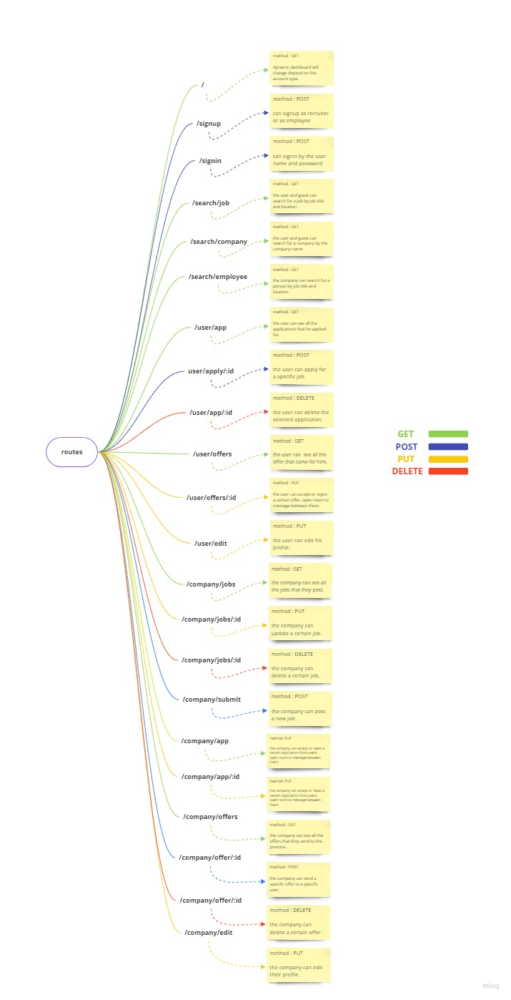

# Jobify-app

## Group members:

- **Abdallah Zakaria**
- **Abdulhakim Zatar**
- **Mohmmad Al-Esseili**
- **Osama Althabteh**

### Problem Domain

Day by day the unemployment issue became a big problem in the world, although that there are so many platforms that help people find jobs, they are too many to follow and a bit complicated in some way , so our plan is to make an employment hub that combine all jobs from different sources in one place and make this process as much easier as it could be.

## Domain Modeling Diagram

## Entity Relationship Diagram

## Project Management Tool

[Trello](https://trello.com/invite/b/qdMApvNd/146e1a2ec506e1d8b85d87decc563a76/englopers-jobify-v2)
